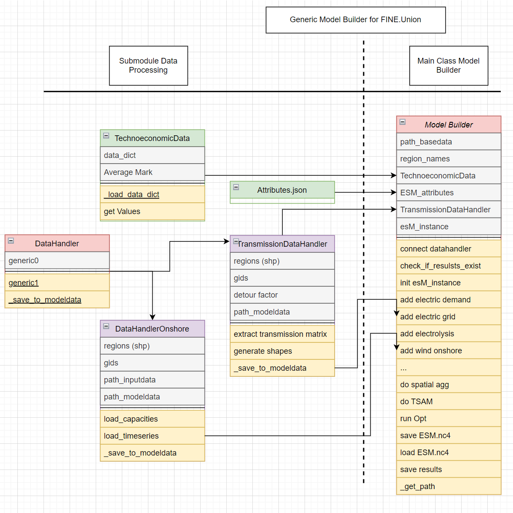

# FINE modelBuilder

A generic model builder for FINE.\
Should be able to aggregate data for given regions shapefiles\
* Potentials and Generation profiles for renewable energy sources
* Demand profiles
* Transmission networks



## Installation

1. First clone a local copy of the repository to your computer, and move into the created directory

```
git clone https://jugit.fz-juelich.de/iek-3/shared-code/fine.union/modelBuilder.git
cd modelBuilder
```

1. (Alternative) If you want to use the 'dev' branch (or another branch) then use:

```
git checkout dev
```

2. When using Anaconda (recommended), modelBuilder should be installable to a new environment with:

```
conda env create --file requirements.yml -n <NEW_ENVIRONMENT_NAME>
```

2. (Alternative) Or into an existing environment with:

```
conda env update --file requirements.yml -n <EXISTING_ENVIRONMENT_NAME>
```

2. (Alternative) If you want to install modelBuilder in editable mode, and also with jupyter notebook and with testing functionalities use:

```
conda env create --file requirements-dev.yml -n <NEW_ENVIRONMENT_NAME>
```
